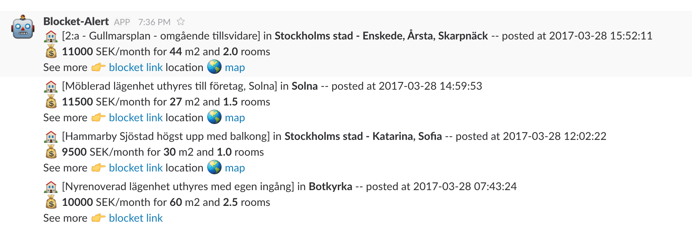

## :bell: Blocket alert ##

This repo contains the code of a Blocket scrapper that sends Slack messages whenever it find an ad that suits your needs, in real-time. The idea comes from [this repo](https://github.com/VikParuchuri/apartment-finder) that does the same for Craigslist. The main advantages are :

 - :clock7: It can send you a message **directly** when a new ad is added on Blocket, which can increase your chances to get a response from a landlord since you will be in the first persons contacting them. No need to check 3 times a day anymore.
 - :thumbsup: It can filter ads for you based on some criteria. Instead of filtering yourself everytime (price, location...) this program does it for you and don't alert you when an ad doesn't suit your needs.

This is how the messages looks like:

This scrapper **only works with the renting** part in the housing section of Blocket. The buying market or anything else are not a part of it. Feel free to submit a PR to include them as well!

## :mailbox_with_mail: Configuration ##

You can easily configure the scrapper with the fields present in the `settings.py` file.
Here are the most important variable to look at when using this scrapper:

    SEARCH_OPTIONS = {
	    'minPrice' : 9000, # minimum price in SEK
	    'maxPrice' : 12000, # maximum price in SEK
	    'minRooms' : 1, # minimum number of rooms
	    'maxRooms' : 3, # maximum number of rooms
	    'minBedrooms' : 1, # minimum number of bedrooms
	    'minSize' : 20, # minimum size in square meters
	    'maxSize' : 80 # maximum size in square meters
	}

    CITY = "stockholm"

    PREFERED_NEIGHBOORHOODS = [ ]

    EXCLUDED_NEIGHBOORHOODS = [
	   'Täby',
	   'Sollentuna'
	]

	SLACK_CHANNEL = '@nicolas' # can also be a channel '#housing' for example

## :floppy_disk: Installation ##

**Slack Integration**

 1. For the scrapper to post on Slack you need to create an "App" for Slack [here](https://api.slack.com/apps) and associate it to the team you want the scrapper to post on.
 2. Once you have created your app, go to the "**Basic Information**" tab and click on "**Add features and functionality**" and under "**Permissions**" add the "**Send message as User**" and "**Send message as [App Name]**" in the "**Permission Scopes**"
 3. Under the "OAuth & Permissions" tab copy the OAuth access Token to your clipboard.
 4. Set it in the appropriate environment variable `export SLACK_API_TOKEN="Your OAuth token here"`

**Python requirements**

 5. Install Python3 and Python3 pip
 6. Install all the Python3 necessary packages `pip3 install BeautifulSoup4 requests sqlalchemy slackclient`
 7. Grant execution permission on the scrapper `chmod +x scrapper.py`
 8. Run it and your good to go `./scrapper.py`

## :chart_with_upwards_trend: Todos ##

 1. Send a link with the location on Google maps, so we can quickly see where the flat is located
 2. Add a filtering option wheter there is a phone number or not, to only show ads with phone numbers for example
 3. Add other part of Blocket, not only the rentals
